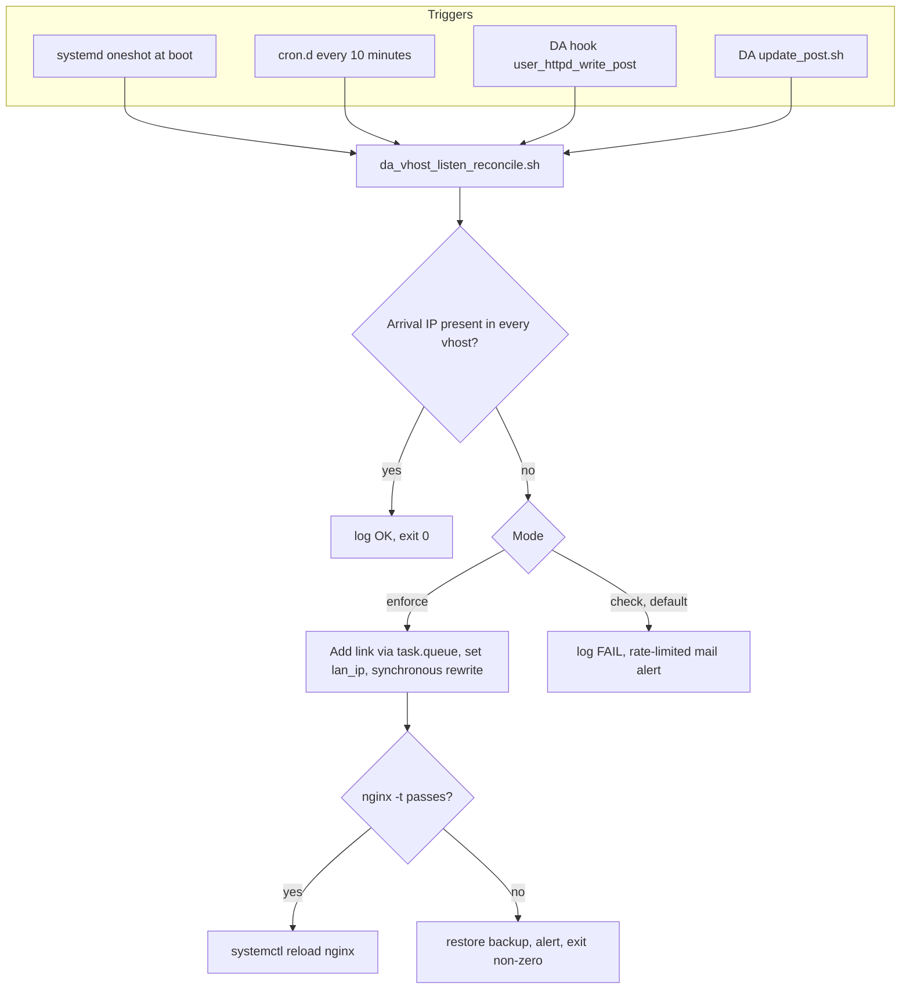

2# Resilient DirectAdmin vhost listens for all domains

## Research confirmed

Environment is EL-family (RHEL/AlmaLinux/Rocky, `dnf`, systemd) per [scripts/README.md](scripts/README.md) and [scripts/directadmin/ses_gmail_forward.md](scripts/directadmin/ses_gmail_forward.md); confirm with `/etc/os-release`. Every step below is scriptable, so **no GUI clicks are required**:

- **Link the private IP to the public IP, applied to all existing domains:** `echo "action=linked_ips&ip_action=add&ip=<PUBLIC>&ip_to_link=<PRIVATE>&apache=yes&dns=no&apply=yes" >> /usr/local/directadmin/data/task.queue`. `apply=yes` is "Apply to existing domains"; `dns=no` keeps the private IP out of DNS. Direction matters: `ip` is the existing public IP, `ip_to_link` is the private IP being added.
- **Register the private IP without touching the NIC:** `CMD_API_IP_MANAGER` with `action=add&ip=<PRIVATE>&netmask=<mask>&add_to_device=no&add_to_device_aware=yes`. Prefer the API over hand-editing `data/admin/ip.list` and `data/admin/ips/<ip>`, which DA warns breaks state.
- **Synchronous rewrite** (instead of waiting on the queue): `/usr/local/directadmin/directadmin taskq --run 'action=rewrite&value=httpd'`, or `&user=<user>` for one account. `dataskq` drains the queue about once a minute.
- **The right hook is `user_httpd_write_post`** — DA calls it after a user's vhost config is written, so it fires on every rewrite. Use the directory form `scripts/custom/user_httpd_write_post/<name>.sh` (DA recommends it over the single-file form so multiple consumers coexist), `chmod 700`, `chown diradmin:diradmin`. **`all_pre.sh`/`all_post.sh` are deprecated** and must not be used. `update_post.sh` gives a post-DA-update trigger.
- **Certificate renewal:** backdate `data/users/<u>/domains/<d>.cert.creation_time` then `directadmin taskq --run 'action=rewrite&value=letsencrypt&domain=<d>'`; hostname cert via `scripts/letsencrypt.sh server_cert`.

**Drift source identified.** [scripts/shrink-migration.config.example.yaml](scripts/shrink-migration.config.example.yaml) carries `old.private_ip` and `new.private_ip`: the EIP cutover moves to an instance with a **different private IP**, which is how `172.30.0.87` went stale. `cmd_post_start` in [scripts/shrink_migration.py](scripts/shrink_migration.py) only runs `setenforce`/`restorecon`, and `run_post_cutover()` in [scripts/shrink-migration-validate.sh](scripts/shrink-migration-validate.sh) checks hostname, public IP, disk, DA license, `nginx -t` and services but never vhost matching. Note the private IP is stable across stop/start (it is ENI-bound) and changes only on instance **replacement**, so cutover is the critical moment and cron is the safety net.

## Architecture

## Layer 0 - Root cause, DA-native and self-propagating

Apply the Linked IP with `apply=yes`. This is the load-bearing fix: DA then emits the private-IP `listen` into every domain's vhost via the `|LINKEDIP|` / `|LINKEDIPSSL|` tokens, it survives `rewrite_confs` and DA updates, and **new domains inherit it automatically** with no hook required. Remove the stale `172.30.0.87` link and set `lan_ip` to the real private IP.

Deliberately **not** using custom `nginx_server*.conf` templates: DA [discourages them](https://docs.directadmin.com/webservices/apache/customizing.html), and replacing `|IP|` with `*` is a known way to land on the default page. Templates stay the documented fallback only.

## Layer 1 - Drift-proofing: the reconciler

New `scripts/directadmin/da_vhost_listen_reconcile.sh`, following the conventions in [scripts/directadmin/ensure_ses_gmail_aliases.sh](scripts/directadmin/ensure_ses_gmail_aliases.sh) (flock, `/var/log` logging, `OK`/`FIXED`/`SKIP`/`ERROR` verbs, idempotent).

Arrival-IP detection, most correct first:
- Query IMDS **v2** (token required: `PUT /latest/api/token` with `X-aws-ec2-metadata-token-ttl-seconds`, then pass `X-aws-ec2-metadata-token`).
- Walk `network/interfaces/macs/<mac>/` and select the ENI whose `public-ipv4s` contains our EIP, then take its primary `local-ipv4`. This is more precise than bare `local-ipv4` on a multi-ENI host.
- Fall back to `ip -4 route get 1.1.1.1` if IMDS is unavailable.

Modes: `--check` (read-only, non-zero on drift), `--enforce`, `--dry-run`. A bare invocation defaults to `--check` so mutation always requires explicit intent; the cron and boot units pass `--enforce` deliberately. The enforce path backs up config, applies the link via `task.queue`, sets `lan_ip`, triggers a synchronous rewrite, then **gates on `nginx -t` before reload** and reverts plus alerts on failure.

Triggers, all cheap. Auto-repair is approved, so the periodic run enforces rather than merely alerting:
- `/etc/cron.d/da-vhost-listen` every 10 minutes in `--enforce` (repo already uses `cron.d`, not timers). Because this now mutates, the `nginx -t` gate, config backup, revert-on-failure and rate-limited alert are load-bearing rather than optional, and enforcement must be a no-op when there is no drift so a healthy box never triggers a rewrite.
- systemd oneshot at boot, `After=network-online.target directadmin.service`, in `--enforce` — this is what catches instance replacement.
- `scripts/custom/user_httpd_write_post/da-vhost-listen-check.sh` in `--check` only. It must never mutate: post-write hooks cannot abort, and rewriting during a rewrite risks a loop.
- `scripts/custom/update_post.sh` after DA updates.

## Layer 2 - Make failure loud instead of silently wrong

Today the catch-all returns `200` with `webserver is functioning normally`, which looks healthy to any uptime check. Add an unambiguous marker (`X-DA-Catchall: 1`) to the catch-all response so detection never depends on fingerprinting a body string or cert CN.

Place it on a surface that survives a rebuild: `custombuild/custom/nginx/conf/nginx-vhosts.conf` (custom copy survives `./build nginx`). Keep `server.wbat.net` itself fully working, since it legitimately serves webmail, phpMyAdmin and DA webapps through `nginx-userdir.conf` / `nginx-info.conf` / `webapps.conf`. Hard-failing unmatched hosts with `421`/`444` stays **opt-in**, since it converts a wrong-cert page into a hard outage.

## Layer 3 - Validation and testing

1. **Static invariant proof (cheapest, catches the whole bug class).** Parse `nginx -T` and assert: for every `server_name`, some `listen` in that block covers the arrival address, for both `:80` and `:443`. This proves the property without touching production.
2. **On-box assertion.** `--check` mode enumerated over the real DA domain list rather than a hardcoded set.
3. **External black-box.** Extend [aws/docs/check-vhost-listeners.sh](aws/docs/check-vhost-listeners.sh): it currently only tests `:443`, but **port 80 broke too**, so add `:80`; add the ACME challenge path; add the `X-DA-Catchall` header check; add `--json` for automation; enumerate domains from DA when run on-box.
4. **Prove the detector without breaking production.** Only the primary server is in scope, so there is no `server2` rehearsal and no unlinking the live IP (that would take every site down). Instead, three non-destructive proofs: an offline fixture test running the invariant parser against a captured known-bad `nginx -T` (the current broken state is itself the perfect fixture — capture it before the fix); a live negative control asserting that a hostname with no vhost is still reported as catch-all after the fix; and a forced run of the alert path to confirm mail and log output actually fire. This proves the guardrail rather than assuming it.
5. **Migration gate.** Add `verify_vhost_listens()` to `run_post_cutover()` in [scripts/shrink-migration-validate.sh](scripts/shrink-migration-validate.sh) so a future cutover cannot be signed off while this is broken, and add a DA-reconcile step to `cmd_post_start` in [scripts/shrink_migration.py](scripts/shrink_migration.py).
6. **CI.** Add a `shellcheck` + `bash -n` job to [.github/workflows/terraform_ci.yml](.github/workflows/terraform_ci.yml) (or a sibling workflow); today CI only covers `terraform fmt`/`validate` while the repo ships a lot of shell.

Acceptance: every DA domain reports `ok` on both ports from outside, `nginx -t` passes, the static invariant holds, ACME challenges resolve from each domain's docroot, `www.tellerstech.com` still returns 200 through CloudFront, and `origin.tellerstech.com` still returns 403 without the secret header.

## Layer 4 - Retire the antipattern

Once the Linked IP is correct, `fix-nginx-loopback-listeners.sh` is redundant and actively dangerous: a second `listen` for the same address in one server block fails `nginx -t`. Sequence matters — inspect whether the patch lives in the generated `nginx.conf` (wiped by rewrite, safe) or in `cust_nginx` (persists, causes duplicates) and remove it in the same window. Record the invariant in the docs: per-domain listen injection is forbidden; Linked IP is the only supported mechanism.

## Deadline

Certificate Transparency shows `iots.com` and `lmgt.com` renewing on a steady ~73-day cadence (2025-10-17, 2025-12-29, 2026-03-12, 2026-05-24), with current certificates valid to **2026-08-22**. This confirms the certs are present and merely unselected, and that no renewal has failed yet. The next automatic attempt falls around **2026-08-05** and will fail against the catch-all, making 2026-08-22 a hard expiry date roughly four weeks out.

## Change window and rollback

Back up `/etc/nginx`, `data/users/*/nginx.conf`, `data/admin/ips/`, and `directadmin.conf`. Snapshot `nginx -T | grep -E 'listen|server_name'` before and after. Then: remove the hand-patch if it is in `cust_nginx`, register the private IP with `add_to_device=no`, link it with `apache=yes&dns=no&apply=yes`, drop the stale `.87` link, set `lan_ip`, rewrite, **gate on `nginx -t`**, reload, run the full validation suite. Rollback is unlink, restore backups, rewrite, reload.

## Access and execution

Run this from **Local mode** using the existing AWS profile and SSM Session Manager. The instance role already attaches `AmazonSSMManagedInstanceCore` in [aws/global/iam/role-WBAT_Main_Server.tf](aws/global/iam/role-WBAT_Main_Server.tf), so no IAM change is expected; the open question is only whether `amazon-ssm-agent` is installed and running on this Alma/Rocky AMI.

Cloud mode cannot do this: it has no AWS credentials, no `~/.aws`, no AWS CLI, no session-manager-plugin, and no injected secrets. Adding long-lived AWS keys as Cloud Agent secrets would also cut against this repo's own stance in [README.md](README.md) ("no long-lived access keys in this repository"), so Local mode with the existing profile is both the preference and the better hygiene.

Still blocked, and it only gates Layer 4: **`tellerstechorg/tellerstech-site` is unreachable** (private; the GitHub App installation covers only `wbat/wbat-terraform`). Needed to read `fix-nginx-loopback-listeners.sh` and determine where it injects, which decides the removal ordering. Once on the box I can read the installed copy directly, which is an acceptable substitute. Also resolve `tellerstech-site` vs `tellerstech-website` — the runbook links are likely dead.

## Secrets hygiene, calibrated

Worth correcting my earlier framing: the actual disclosure risk in the public repo is **low**. The EIP, `server.wbat.net`, and the domain names are all already discoverable through public DNS — that is exactly how I found them from outside the network. Only the RFC1918 addresses are non-public, and they are of little use without access. So this is a convention and reusability question, not a breach, and the pre-existing [502 runbook](aws/docs/cloudfront-tellerstech-502-troubleshooting.md) already committed those private IPs before this work.

New scripts will be config-driven against a placeholder `vhost-listen.conf.example` regardless, because the reconciler needs runtime config anyway and hardcoded values would make it single-host. The pre-existing runbook values stay untouched unless you ask otherwise; note that scrubbing now would not be retroactive, since the values are already in public git history.

## Out of scope

CloudWatch Synthetics or Route 53 health checks would add recurring cost against [aws/docs/cost-optimization-checklist.md](aws/docs/cost-optimization-checklist.md); the credential-free external checker plus the on-box cron covers detection at no cost. Pinning `private_ip` on [aws/us-east-1/ec2/primary-instance.tf](aws/us-east-1/ec2/primary-instance.tf) is rejected: cutover instances are created outside Terraform and imported, so a pinned value would force replacement and collide with `prevent_destroy`. The migration gate in Layer 3 addresses the same risk without that hazard.
