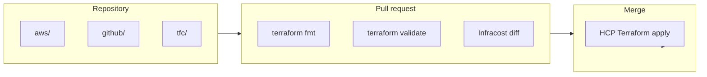

# WBAT Terraform

[](https://github.com/wbat/wbat-terraform/actions/workflows/terraform_ci.yml)
[](https://github.com/wbat/wbat-terraform/actions/workflows/infracost.yml)
[](https://developer.hashicorp.com/terraform)
[](https://registry.terraform.io/providers/hashicorp/aws/latest)
[](https://developer.hashicorp.com/terraform/cloud-docs)
[](https://github.com/wbat/wbat-terraform/blob/main/LICENSE)
[](https://github.com/wbat/wbat-terraform/graphs/commit-activity)

Infrastructure as Code for **WBAT**: AWS resources, GitHub organization settings, and Terraform Cloud workspace configuration. Changes are applied through **HCP Terraform** — not ad-hoc local `terraform apply` in production.

## Repository layout

| Directory | HCP Terraform workspace | Purpose |
|-----------|-------------------------|---------|
| [`aws/`](aws/) | `wbat-terraform-aws` | EC2, VPC, CloudFront, SES, IAM, S3, CloudWatch, and related AWS resources |
| [`github/`](github/) | `wbat-terraform-github` | GitHub organization and repository settings |
| [`tfc/`](tfc/) | `wbat-terraform-tfc` | Terraform Cloud org, workspaces, and variable sets |
| [`aws/docs/`](aws/docs/) | — | Operational runbooks and troubleshooting guides |
| [`scripts/`](scripts/) | — | Optional ops tooling (see [scripts/README.md](scripts/README.md)) |

## Workflow



1. Open a pull request with Terraform or documentation changes.
2. CI runs `terraform fmt`, `terraform validate` (all three workspaces), and Infracost on `**.tf` changes.
3. After merge, HCP Terraform applies the change to the target workspace.

## Prerequisites

- [Terraform](https://developer.hashicorp.com/terraform/install) **≥ 1.15.0** (CI uses **~1.15**; HCP pins in a follow-up PR)
- Access to the **HCP Terraform** organization for plan/apply
- AWS credentials via HCP Terraform role assumption — **no long-lived access keys in this repository**

## Local development

Each workspace is independent:

```bash
cd aws    # or github, tfc
terraform init
terraform validate
```

For credentials and variable definitions, see the comment block at the top of each workspace's `credentials.tf` (for example [`aws/credentials.tf`](aws/credentials.tf)). Sensitive values belong in **HCP Terraform variable sets** ([`tfc/variable-sets.tf`](tfc/variable-sets.tf)) or a local `credentials.auto.tfvars` file, which is gitignored.

Local `terraform plan` against the remote backend requires HCP Terraform authentication; it does not modify infrastructure until an apply is triggered in HCP Terraform.

## Imports

Brownfield resources are imported via blocks in [`aws/imports.tf`](aws/imports.tf). After a successful apply, comment out or remove the corresponding import blocks per repository convention.

## Documentation

| Document | Description |
|----------|-------------|
| [CloudFront 502 troubleshooting](aws/docs/cloudfront-tellerstech-502-troubleshooting.md) | Origin connectivity and CloudFront error diagnosis |
| [Terraform version upgrade](aws/docs/terraform-version-upgrade.md) | Incremental HCP Terraform / CI version bump process |
| [Cost optimization checklist](aws/docs/cost-optimization-checklist.md) | EC2 sizing and cost review notes |
| [Migration scripts](scripts/README.md) | Optional EC2 root-volume shrink tooling |

## Security

- **Never commit** secrets, `credentials.auto.tfvars`, `*.plan`, or environment-specific configuration files.
- Migration script config with live resource IDs belongs in local or S3 storage only — see [scripts/README.md](scripts/README.md).
- Use HCP Terraform variable sets for sensitive values ([`tfc/variable-sets.tf`](tfc/variable-sets.tf)).
- To report a security issue, use [GitHub Security Advisories](https://github.com/wbat/wbat-terraform/security/advisories/new) (private disclosure).

## License

[MIT](LICENSE) — Copyright (c) 2023 WBAT, LLC
